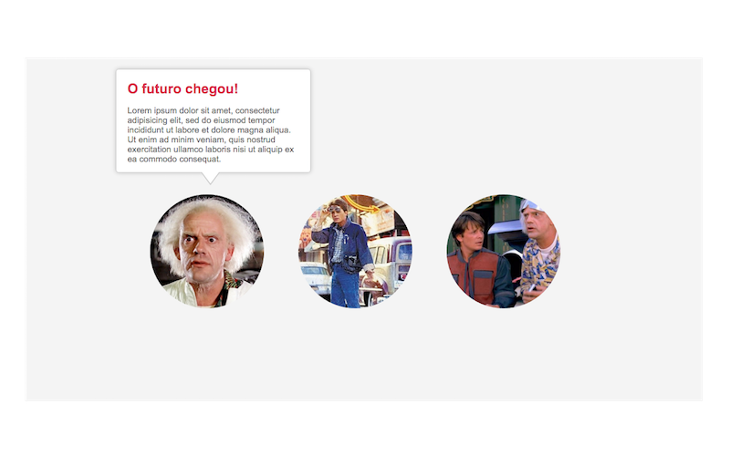

# Como criar meu próprio framework CSS?

Quem nunca começou um projeto e fez os mesmos botões, tabelas, grids que você fez em outro projeto passado? Por quê você não cria o seu próprio framework e utiliza em seus projetos?

Não sou contra quem usa [Bootstrap](http://getbootstrap.com/), [Foundation](http://foundation.zurb.com/) ou outros frameworks que tem por ai, mas será que você realmente precisa deles?

# O que será abordado no workshop?

- Seletores
- Componentização

# Quais componentes vamos criar?

- [Buttons](https://github.com/marcelodeveloper/workshop-css/tree/master/components/buttons)
  - [Dropdown](https://github.com/marcelodeveloper/workshop-css/tree/master/components/buttons)
- [Tooltips](https://github.com/marcelodeveloper/workshop-css/tree/master/components/tooltips)
- [Accordions](https://github.com/marcelodeveloper/workshop-css/tree/master/components/accordions)
- [Modal](https://github.com/marcelodeveloper/workshop-css/tree/master/components/modal)

# Buttons


# Dropdown Buttons


# Tooltips


# Accordions


# Modal


# Então vamos colocar a mão na massa?

------------------------------------------


Antes de tudo, como escrevo código CSS?


Vamos conhecer um pouco dos seletores CSS, vamos abordar algumas coisas importantes aqui. Caso queira um material completo sobre isso, estude por aqui [CSS Reference - Codrops](http://tympanus.net/codrops/css_reference/)

Seleciona qualquer elemento da árvore.
```css
* {
  padding: 10px 20px;
  color: tomato;
}
```
```html
<p>I'm a paragraph</p>
<span>I'm a span</span>
```

------------------------------------------

Seleciona qualquer elemento da árvore. **E**
```css
E {
  text-decoration: underline;
  color: orange;
}
```
```html
<h1>Workshop CSS</h1>
```

------------------------------------------

Para colocar a mesma regra para vários elementos ao mesmo tempo. **E,E...**
```css
div, p, span {
  text-align: center;
  color: orange;
}
```
```html
<div>C</div>
<p>S</p>
<span>S</span>
```

------------------------------------------

Seleciona qualquer elemento **q** dentro de **p**. **p q**
```css
.sponsors img {
  display: block;
  margin: auto;
  border-radius: 50%;
}
```
```html
<div class="sponsors">
  
</div>
```

------------------------------------------

Seleciona qualquer elemento **q** onde o pai é um elemento **p**. **p > q**
```css
div > .featured {
  font-size: 3em;
  text-align: center;
  color: purple;
}
```
```html
<div>
  <span class="featured">I'm featured</span>
</div>

<main>
  <span class="featured">Not featured :/</span>
</main>
```

------------------------------------------

Seleciona qualquer elemento **q** que está imediatamente depois de **p**. **p + q**
```css
div + p {
  color: tomato;
  font-size: 22px;
}
```
```html
<div></div>
<p>Hello!</p>
<h1>I'm a title!</h1>
<p>Hello guys!</p>
```

------------------------------------------

Seleciona qualquer element **q** que está precedido de um elemento **p**. **p ~ q**
```css
.container ~ .list {
  padding: 20px;
  background: purple;
}
```
```html
<p>Hello!</p>
<ul class="list">
  <li>Item 1</li>
  <li>Item 2</li>
  <li>Item 3</li>
</ul>
<div class="container"></div>
<ul class="list">
  <li>Item 1</li>
  <li>Item 2</li>
  <li>Item 3</li>
</ul>
<h1>Title!!!</h1>
<ul class="list">
  <li>Item 1</li>
  <li>Item 2</li>
  <li>Item 3</li>
</ul>
```

------------------------------------------

Seleciona qualquer elemento que contém **.class**
```css
.featured {
  color: yellow;
  font-size: 2.5em;
}
```
```html
<span class="featured">Featured span!</span>
<div class="featured">Featured div!</div>
```

------------------------------------------

Seleciona qualquer elemento que contém **#id**
```css
#name {
  font-weight: bold;
  font-size: 3em;
  color: red;
}
```
```html
<p id="name">Marcelo Silva</div>
```

------------------------------------------

Seleciona um elemento com um atributo específico. **E[attr]**
```css
E[lang] {
  color: gray;
}
```
```html
<span lang="">Hello there!</span>
<span>Psiuuu!!!</span>
```

------------------------------------------

Seleciona um elemento que contém um atributo com um valor específico. **E[attr="value"]**
```css
E[lang="pt-br"] {
  color: blue;
}
```
```html
<span lang="pt-br">Hello Marcelo!</span>
<span lang="en">Hello there!</span>
<span>Helllooooo!</span>
```

------------------------------------------

Seleciona um elemento cujo o valor do atributo "attr" é exatamente "value" ou contém o "value" entre espaços em branco. **E[attr~="value"]**
```css
E[name~="Marcelo"] {
  color: red;
}
```
```html
<h1 name="José Marcelo">Marcelo Silva!</h1>
```

------------------------------------------

Seleciona um elemento cujo valor do atributo "attr" começa com a string "value". **E[attr^="value"]**

```css
span[value^="workshop"] {
  color: green;
}
```
```html
<span value="css workshop">Hellloooo!</span>
<span value="workshop css">Helllo!</span>
```

------------------------------------------

Seleciona um elemento cujo valor do atributo "attr" termina com a string "value". **E[attr$="value"]**

```css
span[value$="css"] {
  color: yellow;
}
```
```html
<span value="css workshop">Hellloooo!</span>
<span value="workshop css">Helllo!</span>
```

------------------------------------------

Seleciona um elemento cujo valor do atributo "attr" contém a substring "value". **E[attr*="value"]**

```css
span[value*="fa7"] {
  color: yellow;
}
```
```html
<span value="Workshop CSS na fa7">Workshop CSS na FA7</span>
```

------------------------------------------

Seleciona um elemento cujo valor do atributo "attr" é exatamente "value" ou começa com "value". **E[attr|="value"]**

```css
span[lang|="pt"] {
  color: green;
}
```
```html
<span lang="pt">Text pt</span>
<span lang="pt-br">Text pt</span>
<span lang="pt br">Text pt</span>
```

------------------------------------------

# Pseudo-classes

A pseudo-classe CSS é uma palavra-chave adicionada à seletores que especifica um estado especial do elemento a ser selecionado.

------------------------------------------

- **E:hover** = Quando o usuário passa o mouse por cima do elemento
- **E:focus** = Quando o elemento recebe um foco, pode ser pelo teclado ou mouse
- **E:enabled** = Quando um elemento está ativado
- **E:disabled** = Quando um elemento está desativado
- **E:first-child** = Pega o primeiro filho
- **E:last-child** = Pega o último filho
- **E:required** = Quando o input tem o atributo required
- **E:checked** = Quando qualquer elemento radio, checkbox, ou um option dentro de um select está checkado
